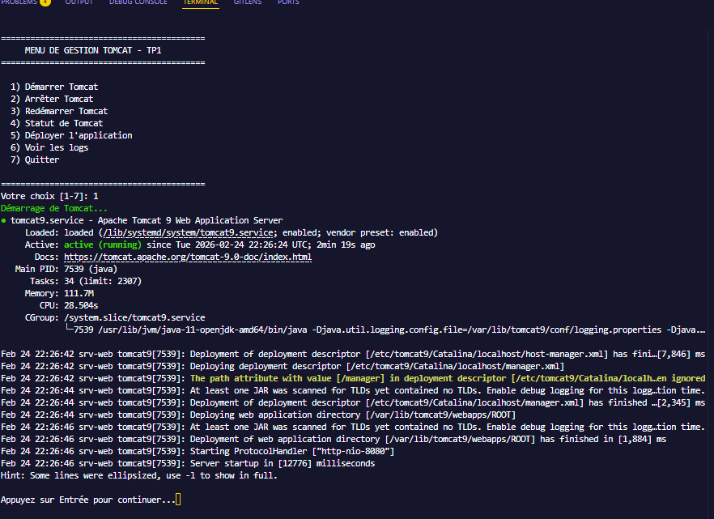
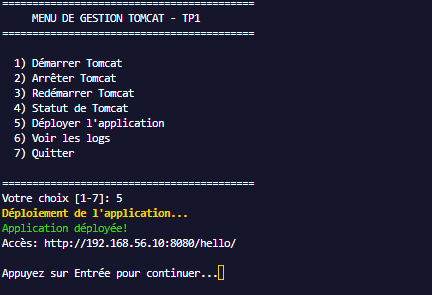
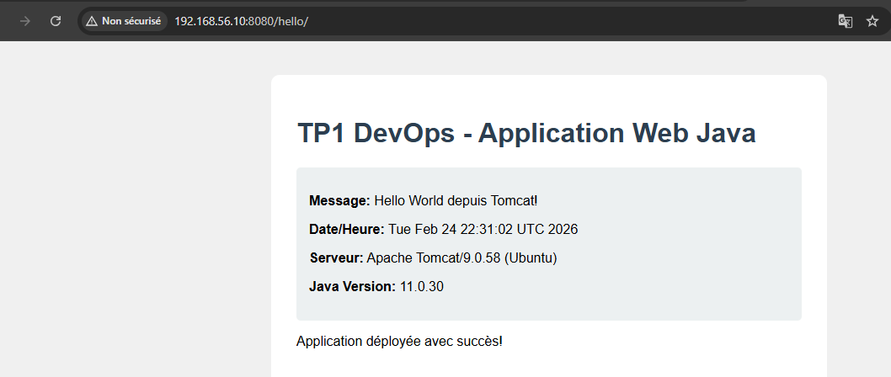

# TP1 DEVOPS - Déploiement d'une application web Java

## Objectif du TP

Créer une machine virtuelle avec Vagrant et y déployer une application web Java sur Tomcat 9.

## Architecture

```
┌─────────────────────────────────────┐
│           VM: srv-web               │
│         IP: 192.168.56.10           │
│                                     │
│  ┌─────────────────────────────┐    │
│  │   Ubuntu 22.04 (Jammy)      │    │
│  │                             │    │
│  │   • JDK 8, 11, 17          │    │
│  │   • Tomcat 9 (port 8080)   │    │
│  │   • Application Hello      │    │
│  └─────────────────────────────┘    │
└─────────────────────────────────────┘
```

## Structure du projet

```
TP1-srv-web/
├── Vagrantfile           # Configuration de la VM
├── README.md             # Ce fichier
├── scripts/
│   ├── install-java.sh   # Installation JDK 8, 11, 17
│   ├── install-tomcat.sh # Installation Tomcat 9
│   └── deploy.sh         # Script de déploiement avec menu
└── app/
    └── build-app.sh      # Création de l'application WAR
```

## Comment lancer le TP

### Prérequis
- VirtualBox installé
- Vagrant installé

### Étapes

1. **Ouvrir un terminal** dans ce dossier

2. **Lancer la VM**
   ```bash
   vagrant up
   ```
   > Cela crée la VM et installe automatiquement Java et Tomcat

3. **Se connecter à la VM**
   ```bash
   vagrant ssh
   ```

4. **Utiliser le script de déploiement**
   ```bash
   bash /vagrant/scripts/deploy.sh
   ```

5. **Accéder à l'application** dans votre navigateur:
   - Tomcat: http://localhost:8080
   - Application: http://localhost:8080/hello/

## Commandes utiles

### Gestion de la VM
```bash
vagrant up          # Démarrer la VM
vagrant ssh         # Se connecter en SSH
vagrant halt        # Arrêter la VM
vagrant destroy     # Supprimer la VM
vagrant provision   # Ré-exécuter les scripts
```

### Dans la VM
```bash
# Changer la version de Java par défaut
sudo update-alternatives --config java

# Vérifier la version Java
java -version

# Gérer Tomcat
sudo systemctl start tomcat
sudo systemctl stop tomcat
sudo systemctl status tomcat

# Voir les logs Tomcat
sudo tail -f /opt/tomcat/logs/catalina.out
```

## Le script deploy.sh

Le script `deploy.sh` propose un menu interactif avec les options:

| Option | Description |
|--------|-------------|
| 1 | Démarrer Tomcat |
| 2 | Arrêter Tomcat |
| 3 | Redémarrer Tomcat |
| 4 | Voir le statut |
| 5 | Déployer l'application |
| 6 | Voir les logs |
| 7 | Quitter |

## Explications techniques

### Vagrantfile
- `config.vm.box`: Image Ubuntu utilisée
- `config.vm.network "forwarded_port"`: Redirige le port 8080 de la VM vers l'hôte
- `config.vm.provision "shell"`: Exécute les scripts au démarrage

### Installation Java
- 3 versions installées: JDK 8, 11, 17
- JDK 11 configuré par défaut
- `JAVA_HOME` défini dans `/etc/environment`

### Installation Tomcat
- Installé dans `/opt/tomcat`
- Utilisateur système `tomcat` créé
- Service systemd configuré pour démarrage automatique

### Application WAR
- Simple page JSP affichant "Hello World"
- Fichier `web.xml` pour la configuration
- Packagée en `.war` avec la commande `jar`

## Points de vérification

- [ ] VM démarrée avec `vagrant up`
- [ ] Connexion SSH fonctionnelle
- [ ] Java 11 par défaut (`java -version`)
- [ ] Tomcat actif (`systemctl status tomcat`)
- [ ] Application accessible sur http://localhost:8080/hello/

## Captures

### Démarrage Tomcat via menu


### Déploiement application


### Résultat déploiement réussi


## Auteur

Étudiant M2 Génie Logiciel - Cours DevOps
